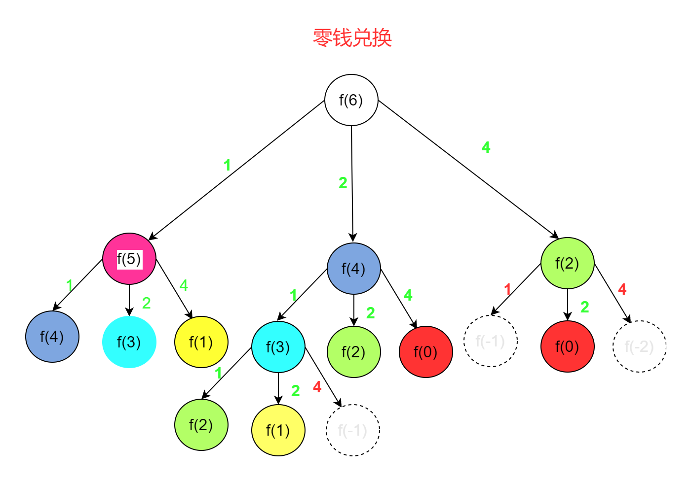
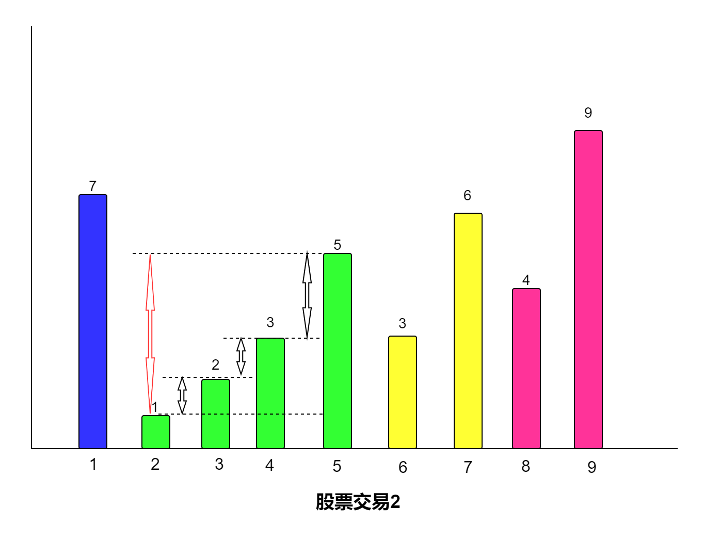

# 动态规划
动态规划，指的是你当前的状态会受到你之前的状态的影响（或者说你现在的状态会影响到你将来的状态）。

## 动态规划的思考步骤：
1. 由于每一个状态都会受到之前的状态的影响，因此我们需要一个**状态容器**来保存所有的状态。 一般是一维或者二维数组。
2. 容器初始化，一般都会知道最初始的几个状态
3. 状态转移方程
4. 返回这个结果


### 爬楼梯问题
状态方程：f(k) = f(k-1) + f(k-2)
```js
var climbStairs = function (n) {
    if(n == 1) return 1;
    if(n == 2) return 2;
  // 第一步：创建一个状态容器：
  var arr = [];
  // 第二步：初始化：
  arr[0] = 1;
  arr[1] = 2;
  // 状态转移方程，计算每一个状态
  for(let i = 2;i < n;i++){
      arr[i] = arr[i-1] + arr[i-2];
  }
  // 返回指定的状态
  return arr[n-1];
};
```

### 不同路径问题：
```js
var uniquePaths = function (m, n) {
  // 第一步：状态容器：
  var arr = new Array(m);
  for(let j = 0;j < arr.length;j++){
      arr[j] = new Array(n);
  }
  // 初始化
  arr[0][1] = 1;
  console.log(arr);
  for(let i =0;i < m;i++){
      arr[i][0] = 1;
  }
  for(let j =0;j < n;j++){
      arr[0][j] = 1;
  }
  // 状态转移方程:f(i,j) = f(i-1,j)+f(i,j-1)
  for(let i = 1;i < m;i++){
      for(let j = 1;j < n;j++){
          arr[i][j] = arr[i-1][j] + arr[i][j-1];
      }
  }
  return arr[m-1][n-1];
};

```


### 动态规划状态转移方程的确认
动态规划问题，最难的就是状态转移方程的确认
1. 确定状态。也就是原问题和子问题中变化的变量。

## 零钱兑换

```js
给定不同面额的硬币 coins 和一个总金额 amount。编写一个函数来计算可以凑成总金额所需的最少的硬币个数。如果没有任何一种硬币组合能组成总金额，返回 -1。你可以认为每种硬币的数量是无限的。

输入：coins = [1, 2, 5], amount = 11
输出：3 
解释：11 = 5 + 5 + 1
```

面对这种题目，我们的第一想法使用暴力法就是**穷举法**。但是很明显，硬币的数量不确定，而且每种硬币的使用次数不限制，也就是说我们穷举时，可能会有无数的次数。然后我们需要从这无数次中找出符合条件的，我们很难从这无数种可能种进行处理，因此，像这种处理起来数据比较庞大，很难穷举的基本上就需要使用**动态规划了**。动态规划最重要的就是找到**状态转移方程**。

#### 状态转移方程

状态转移方程，指的是某种状态依赖于其他的状态，或者说由其他状态得到而来。因此，**最重要的就是找到哪个在发生变化，也就是我们常说的`dp[i]`。这里的i到底是什么。**

一般有两种方法，自顶向下或者自底向上。因此，我们最好的办法就是去查找这个自顶向下和自底像上中变化的是哪个。以上面中题目为例，一共有两个变量。不同面额的硬币和总金额，那么转移的基本上就是硬币或者总金额。我们分析可以发现，每种硬币的数量是无限的，也就是说使用一次之后还可以重复使用。这样的话就不涉及变化了。因此，变化的应该是总金额。如下所示：



如上图所示：我们可以发现总金额为6的硬币个数可以等于：

1. 拿一枚面值为 1 的硬币 + 总金额为 5 的最优解法的硬币数量。相当于db(5)+1。这里的1是指拿金额为1的这一枚硬币。
2. 拿一枚面值为 2 的硬币 + 总金额为4 的最优解法的硬币数量。相当于db(4)+1。这里的1是指拿金额为2的这一枚硬币。
3. 拿一枚面值为 4 的硬币 + 总金额为1的最优解法的硬币数量。相当于db(1)+4。这里的1是指拿金额为2的这一枚硬币。
以上三种情况的最小值。
也就是说db[6] = Math.min(db(5)+1,db(4)+1,db(2)+1)。这里的5,4,2分别代表amount-coin。也就是说：
```js
db[i] = Math.min(db[i-coin1]+1,db[i-coin2]+1,db[i-coin3]+1,...);
```
这就是我们得到的状态转移方程。

#### 初始化容器
由于动态规划问题，一般都会有很多重复的计算，因此，通常会使用一个容器来存储这些状态。因此，我们需要直到我们要初始化一个什么样的容器。一般需要考虑这些：
1. 是一维数组，还是二维数组还是三维数组。一般是根据有几种状态来确定是几维数组。比如我们这里只有一种状态，那么就是一维数组。
2. 容器中状态是否需要初始化值（比如初始化为null或者初始化为Infinity）


#### 确定初始化值
对于动态规划问题来说，一般都能够很直接的得到初始化的一个或者几个值。比如我们这里的硬币问题，db[0]=0。

#### 代码实现
```js
var coinChange = function (coins, amount) {
    // 初始化状态容器
    let dp = new Array(amount + 1).fill(Infinity); 
    // 初始化状态
    dp[0] = 0;
    // 状态转移方程
    for (let i = 1; i <= amount; i++) {
        for (let coin of coins) {
            if (i - coin >= 0) {
                // 实现状态转移方程
                dp[i] = Math.min(dp[i], dp[i - coin] + 1);
            }
        }
    }
    // 如果不存在就是-1。如果存在就直接返回
    return dp[amount] === Infinity ? -1 : dp[amount];
};
```

### 121买卖股票的最佳时机1
>给定一个数组 prices ，它的第 i 个元素 prices[i] 表示一支给定股票第 i 天的价格。你只能选择 某一天 买入这只股票，并选择在 未来的某一个不同的日子 卖出该股票。设计一个算法来计算你所能获取的最大利润。返回你可以从这笔交易中获取的最大利润。如果你不能获取任何利润，返回 0 。
示例1
输入：[7,1,5,3,6,4]
输出：5
解释：在第 2 天（股票价格 = 1）的时候买入，在第 5 天（股票价格 = 6）的时候卖出，最大利润 = 6-1 = 5 。
     注意利润不能是 7-1 = 6, 因为卖出价格需要大于买入价格；同时，你不能在买入前卖出股票。

#### 分析
由于只能在某一天买入，并且在未来的某一天卖出。因此想要实现最大的利润，那么应当是在股票最低的时候买入，在股票最高的时候卖出。也就是说我们需要找到每一天的股票价值，假设当天卖出，然后找到它之后的最大值。两者的差值就是股票利润。我们找到这个利润的最大值即可。

#### 暴力破解法
```js
var maxProfit = function (prices) {
  let max = 0;
  for(let i = 0;i<prices.length;i++){
      for(let j = i+1;j<prices.length;j++){
          max = Math.max(max,prices[j]-prices[i]);
      }
  }
  return max;
};
```
上面这种方法是暴力破解法，其时间复杂度是O(n^2)，空间复杂度是O(1)，O(n^2)的时间复杂度不是一个好的算法。最终提交时我们也会发现超时。因此，我们需要优化我们的算法。很明显只能往O(logn)和O(n)上进行优化。由于这里不涉及到查找，因此应该不能使用O(logn)，最终的算法时间复杂度应该是O(n)。也就是说我们需要减少一次循环。

#### 快慢指针法
我们可以发现外面的循环是遍历整个数组，里面的for循环是找到当前元素后面的元素与它的差值的最大值。事实上里面的很多循环我们都是可以避免的。比如：
```js
[1,5,3,6,4];
我们先遍历1，找出它的最大值。
接下来遍历5，3，4，6，他们都比1大，也就是说他们的后面的的x-5(x-3,x-6,x-4)等一定比(x-1)小。
也就是说我们其实只需要记录以下当前的最小值，以及当前最小值对应的最大利润。
如果后面有比它更小的，我们更新最小值，每次拿差值跟之前的最大利润进行对比即可。
```
代码示例：
```js
var maxProfit = function (prices) {
   let curMin = prices[0];
   let curMax = 0;
   for(let i = 1;i < prices.length;i++){
       if(prices[i] <curMin){
           curMin = prices[i];
       }else{
           curMax = Math.max(curMax,prices[i] - curMin);
       }
   }
   return curMax;
};
```
我们用更加明显的快慢指针来实现看看：
```js
var maxProfit = function (prices) {
    let i = 0;
    let j = i+1;
    let max = 0;
    while(j < prices.length){
        if(prices[i] > prices[j]){
            // 在j后面的值与j的差值一定比i更大，因此不需要遍历i了
            i = j;
            j = i+1;
        }else{
            max = Math.max(prices[j] - prices[i],max);
            j++;
        }
    }
    return max;
};
```
### 122.买卖股票的最佳时机2
>给定一个数组，它的第 i 个元素是一支给定股票第 i 天的价格。设计一个算法来计算你所能获取的最大利润。你可以尽可能地完成更多的交易（多次买卖一支股票）。
注意：你不能同时参与多笔交易（你必须在再次购买前出售掉之前的股票）。
示例：
输入: [7,1,5,3,6,4]
输出: 7
解释: 在第 2 天（股票价格 = 1）的时候买入，在第 3 天（股票价格 = 5）的时候卖出, 这笔交易所能获得利润 = 5-1 = 4 。
     随后，在第 4 天（股票价格 = 3）的时候买入，在第 5 天（股票价格 = 6）的时候卖出, 这笔交易所能获得利润 = 6-3 = 3 。

#### 分析
我们可以发现，和上面的股票交易只能交易一次，只需要找出最小值和记录最大差值。这次股票交易允许多次交易。其实思路还是一样的，我们需要找到某一段时间内的最小值和最大值。以下面的股票价格为例：
```js
[7,1,2,3,5,3,6,4,9,11]
1. [1,2,3,5] 这段时间内的最大差值为 5-1=4
2. [3,6]这段时间内的最大差值为3
3. [4,9,11]这段时间的最大差值是11-4 = 7。
因此，最终交易的最大利润是：4+3+7=14。
```
从上面的分析中我们可以看出，实际上我们就是找每个递增子序列的最大值和最小值。

我们要查找每个区间的最大值和最小值的差值。我们可以发现这个差值实际上是有序数列中每个差值的和。比如：
```js
[1,2,3,5]这个有序数列的差值是:5-1 = 4。它等价于：
2-1 = 1
3-2 = 1
5-3 = 2
1+1+2=4
```
也就是说我们实际上最终要实现的就是把。前一个大于后一个的差值累加起来即可。

#### 代码实现:
```js
var maxProfit = function (prices) {
  let max = 0;
  for(let i = 1;i < prices.length;i++){
      if(prices[i] > prices[i-1]){
          max = max + (prices[i] - prices[i-1]);
      }
  }
  return max;
};
```