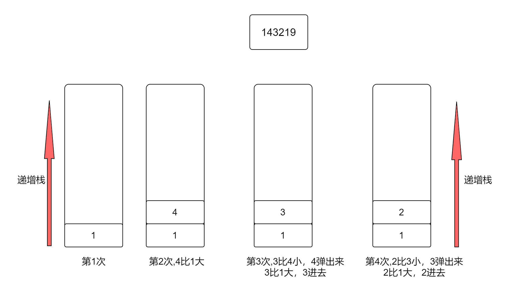

## 单调栈
单调栈是指保持栈中的元素是递增的或者是递减的。
1. 如果是递增的。新加入的元素如果小于栈顶元素，那么就需要pop掉栈中的一些元素
2. 如果是递减的。新加入的元素如果如果大于栈顶元素，那么也需要pop掉栈中的一些元素。


### 移除k位数字


```js
var removeKdigits = function (num, k) {
    let len = num.length;
    let remain = len - k; // 剩余数字的长度
    console.log("remain:", remain)
    if (remain === 0) {
        return "0"
    }
    let stack = [];
    let i = 0;
    while (i < len) {
        // 递增栈 14 2 弹出4
        if (stack.length >= 1) {
            let top = stack[stack.length - 1];
            let remainNumCount = len - i + stack.length - 1;
            if (num[i] < top && remainNumCount >= remain) {
                // 必须确保是栈中的长度
                stack.pop();
            } else {
                stack.push(num[i]);
                i++;
            }
        } else {
            stack.push(num[i]);
            i++;
        }
    }
    while(stack.length > remain){
        stack.pop();
    }
    let result = stack.join("").replace(/^0+/, "");
    return result === "" ? "0" : result;
};


```