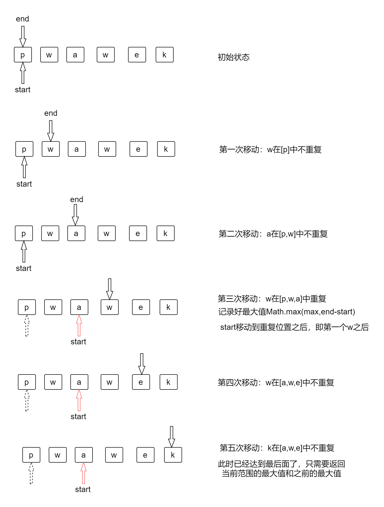
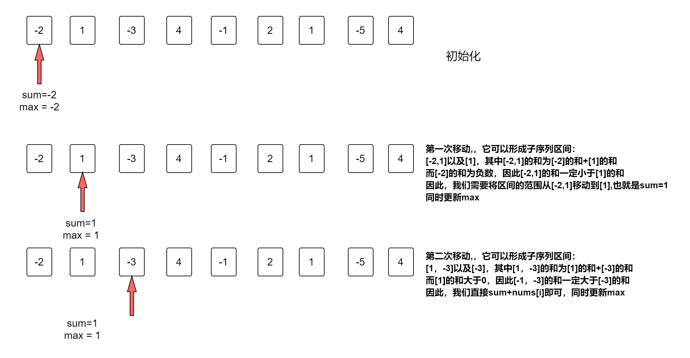

# 双指针问题

数组/列表/字符串中一般为左右指针，链表中一般为快慢指针。既然分左右，那么一般要求 left <= right。

### 应用一：二分查找

给定一个数组:arr = [ 1,3,5,7,9,11,14,16,15];
查找 target 为 16 的值的索引。

```js
function two_part(arr, target) {
  let left = 0;
  let right = arr.length - 1;
  let mid;
  while (left <= right) {
    mid = Math.floor((left + right) / 2);
    if (arr[mid] < target) {
      left = mid + 1;
    } else if (arr[mid] > target) {
      right = mid - 1;
    } else {
      return mid;
    }
  }
  return -1;
}
```

像这种需要不断地在范围内进行查找的，通常都会设置左右两个指针，然后二分之后，修改其中一个指针。

### 应用二：两数之和

```js
function two_sum(arr, target) {
  let left = 0;
  let right = arr.length - 1;

  while (left < right) {
    // 左值+右值大于target说明大了
    if (arr[left] + arr[right] > target) {
      // 大了，将右边的指针往左移动
      right -= 1;
    } else if (arr[left] + arr[right] < target) {
      left += 1;
    } else {
      return [left, right];
    }
  }
  return false;
}
```

### 应用三：不重复的子串


寻找最长的子串，最好的方法就是不断地去查找某个区间之间的最长的子串，
然后不断扩大这个区间范围，直到扩充到最后。因此，我们的实现思路如下：

1. 定义两个变量 start 和 end。start 表示左区间，end 表示右区间。
2. 移动右指针，扩大区间范围，观察[start,end]之间是否有重复。如果没有重复，继续往后移动。
3. 如果有重复。那么就记录当前[start,end]之间的长度，并与之前保留的最大长度进行比较，保留最大值。同时 start 移动到出现重复元素的第一个位置(只有重复元素之后的区间才可能不会再重复))。
4. 注意 start 移动时，只能往后移动不能往前移动
5. 注意最后返回的是区间之间的长度和当前记录的最大值之间的最大值。因为此时可能没有再出现重复，因此没有对最大值进行赋值。

```js
var lengthOfLongestSubstring = function(s) {
  let start = 0;
  let end = 0;
  let max = 0;
  let obj = {};
  while (end <= s.length - 1) {
    if (!(s[end] in obj)) {
      obj[s[end]] = end;
      end += 1;
    } else {
      max = Math.max(max, end - start);
      // start指针不能往后退，只能是当前一个和最新的中的最大值
      start = Math.max(obj[s[end]] + 1, start);
      obj[s[end]] = end;
      end += 1;
    }
  }
  return Math.max(max, end - start); // 返回最大值
};
```

### 应用四——连续最长数字子序

双指针问题的关键是其中一个动，达到某个条件之后，需要另外一个动，因此关键是什么情况下达到条件，已经另外一个指针如何动。

```js
function longestNumberSubstring(str) {
  let start = 0;
  let end = 0;
  let result = "";
  while (end < str.length) {
    if (!isNumber(str[end])) {
      result = end - start > result.length ? str.slice(start, end) : result;
      start = end + 1;
      end += 1;
    } else {
      // 前一个不是number
      if (!isNumber(str[end - 1])) {
        start = end;
        end += 1;
      } else {
        if (str[end] - str[end - 1] == 1) {
          end += 1;
        } else {
          result = end - start > result.length ? str.slice(start, end) : result;
          start = end;
          end += 1;
        }
      }
    }
  }
  return result;
}

function isNumber(value) {
  const re = /[0-9]/g;
  return re.test(value);
}
```

### 应用五：最大子序列和

> 给定一个整数数组 nums， 找到一个具有最大和的连续子数组（ 子数组最少包含一个元素）， 返回其最大和。
> 输入： nums = [-2, 1, -3, 4, -1, 2, 1, -5, 4]
> 输出： 6
> 解释： 连续子数组[4, -1, 2, 1] 的和最大， 为 6。

#### 分析

实际上就是遍历每个元素的区间，然后找到这个区间的最大值。查看暴力破解的方法。

#### 暴力破解法

```js
var maxSubArray = function(nums) {
  if (nums.length == 1) {
    return nums[0];
  }
  let max = -Infinity;
  for (let i = 0; i < nums.length; i++) {
    for (let j = i; j < nums.length; j++) {
      let partitionArr = nums.slice(i, j + 1);
      let sum = getSum(partitionArr);
      console.log("sum:", sum);
      max = Math.max(sum, max);
    }
  }
  function getSum(arr) {
    return arr.reduce((result, currentValue) => {
      result += currentValue;
      return result;
    }, 0);
  }
  return max;
};
```

但是，上面的代码我们可以发现，我们每次都切割了一个数组，然后调用`getSum`去计算它的和，但是实际上我们只需要记录最大值就行了，因此我们可以使用更加取巧的方法去进行计算。

```js
var maxSubArray = function(nums) {
  let max = -Infinity;
  let sum = 0;
  for (let i = 0; i < nums.length; i++) {
    for (let j = i; j < nums.length; j++) {
      sum += nums[j];
      max = Math.max(sum, max);
    }
    sum = 0;
  }
  return max;
};
```

这样的化，就节省了数组切割，计算数组的和的过程，大大优化了效率。但是我们可以发现我们的时间复杂度是 O(n^2)，在 leetcode 提交后只击败了 5%的用户，说明代码不够优化。

#### 动态规划法


如上图所示，我们可以发现，实际上我们只需要判断之前的子序列的和是否大于 0，因为只有大于 0，它加上当前的值才会更大，如果小于 0，那么它的区间的和一定小于当前值，那么直接更新区间即可。

```js
var maxSubArray = function(nums) {
  let sum = nums[0];
  let max = nums[0];
  for (let i = 1; i < nums.length; i++) {
    if (sum > 0) {
      sum += nums[i];
    } else {
      sum = nums[i];
    }
    max = Math.max(sum, max);
  }
  return max;
};
```

### 应用 6 三数之和

分析：三数之和，如果使用暴力破解的方法，那么需要遍历三次，时间复杂度就是 O(n^3)，毫无疑问非常低下，常见的优化措施就是：

1. 空间换时间
2. 排序换时间
   在这里我们很难使用空间去换时间，因此，最常见的解决方法就是先排序，然后排序后使用双指针法进行优化，减少很多不必要的重复操作。

双指针法在排序后的应用：

1. 排序后的数字一定是定义前后两个指针
2. 双指针法的循环终止条件一般就是前后两个指针相等的情况。

```js
var threeSum = function(nums) {
  let result = [];
  nums.sort((a, b) => a - b);
  for (let i = 0; i < nums.length; i++) {
    if (i > 0 && nums[i] == nums[i - 1]) {
      continue;
    }
    let left = i + 1;
    let right = nums.length - 1;
    while (left < right) {
      let sum = nums[i] + nums[left] + nums[right];
      if (sum < 0) {
        left++;
      } else if (sum > 0) {
        right--;
      } else {
        result.push([nums[i], nums[left], nums[right]]);
        left++;
        right--;
        while (left < right && nums[left] === nums[left - 1]) {
          left++;
        }
        while (left < right && nums[right] === nums[right + 1]) {
          right--;
        }
      }
    }
  }
  return result;
};
```

## 11.盛水最多的容器

盛水最多的容器其实就是计算前后前后两个坐标的插值和高度的最小值的最大乘积。

1. 前后两个坐标的插值，实际上就是两个指针的插值，因此我们给定前后两个指针(一开始一定是宽度最大)，然后就取决于高度了。
2. 由于我们需要找到面积的最大值，目前宽度已经是最大了，移动指针，导致宽度缩小，因此只有高度更大才可能存在面积最大的。也就是说我们需要判断哪个高度小就移动哪个指针。

```js
var maxArea = function(height) {
  let max = 0;
  let left = 0;
  let right = height.length - 1;
  while (left < right) {
    let area = (right - left) * Math.min(height[left], height[right]);
    max = Math.max(max, area);
    if (height[left] <= height[right]) {
      left++;
    } else {
      right--;
    }
  }
  return max;
};
```

## 双指针法总结：

使用双指针法一般是简化循环，将需要多个循环简化成通过一个循环，减少很多不必要的操作。技巧是：

1. 定义前后两个指针，注意一般是前后两个指针（尤其适合于有序的情况下），而不是两个挨着的指针(也有两个挨着的指针)
2. 结束条件一般是前后指针相等。
