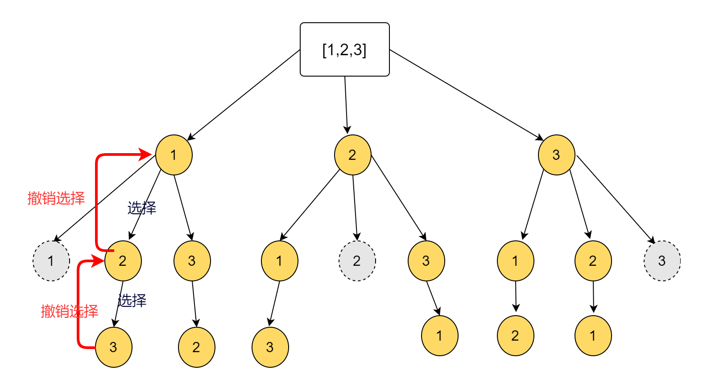

# 回溯法:

回溯问题实际上就是路径查找问题：这种问题的逻辑是如果数据比较少，可以通过多层 for 循环来实现，比如 4 个数中，找出 2 个数的排组合。[[1,2],[1,3],[2,3]...]，我们可以通过 2 层 for 循环来帮助我们查找。但是如果是 10 个数中找出 5 个的组合，那么我们就需要进行 5 此 for 循环，如果更多数需要更多 for 循环，这很明显是无法暴力遍历出来的。而回溯法的目的就是用于处理这种不知道要嵌套多少个 for 循环的情况。
回溯法的套路是：

1. 一个函数，函数的功能就是实现 for 循环。
2. 第一个参数为 n，表示多少个数，比如 4 个数中进行查找，k 表示查找多少个数，比如查找 2 个数([1,2])的组合，startIndex 表示下一次回溯的起始位置，比如已经选择了 1，那么下一次就只能是(2,3,4)，起始位置就是 2，path 是用于存储路径的，每次回溯一次存储一个，直到数组长度等于 k 表示到达终止位置了。result 用来保存最终的结果。
3. 注意：每次回溯完毕需要弹出一个数。回到上一个交叉点。

### 回溯法解决组合问题：

```js
function dfs(n, k, startIndex, path, result) {
  for (let i = startIndex; i < n + 1; i++) {
    path.push(i);
    if (path.length === k) {
      // 达到终止条件，说明不用再往下进行遍历了。
      result.push([...path]);
    } else {
      // 否则继续往下查找其他的数。
      dfs(n, k, i + 1, path, result);
    }
    path.pop();
  }
  return result;
}
```

### 回溯法解决子集问题：

```js
var subsets = function(nums) {
  var result = [[]];
  var path = [];
  var n = nums.length;
  var k = n;
  var dfs = function(n, k, startIndex, path, result) {
    for (var i = startIndex; i < nums.length; i++) {
      path.push(nums[i]);
      if (path.length === k) {
        result.push([...path]);
      } else {
        result.push([...path]);
        dfs(n, k, i + 1, path, result);
      }
      path.pop();
    }
    return result;
  };
  return dfs(n, k, 0, path, result);
};
```

### 回溯法解决全排列问题:

```js
var permute = function(nums) {
  var n = nums.length;
  var k = n;
  var path = [];
  var result = [];
  var diffArr = function(arr1, arr2) {
    return arr1.filter((item, index) => {
      return arr2.indexOf(item) === -1;
    });
  };
  var dfs = function(n, k, arr, path, result) {
    for (var i = 0; i < arr.length; i++) {
      path.push(arr[i]);
      if (path.length === k) {
        result.push([...path]);
      } else {
        var newArr = diffArr(arr, path);
        dfs(n, k, newArr, path, result);
      }
      path.pop();
    }
    return result;
  };
  return dfs(n, k, nums, path, result);
};
``;
```

### 回溯法解决括号生成问题:

括号生成问题也可以用回溯法来实现，只要是涉及到能够用树状结构来描述的问题，都可以用回溯法来解决。

```js
var generateParenthesis = function(n) {
  var arr = ["("];
  var path = [];
  var result = [];
  var leftCount = 0; // 用于记录(的个数
  var rightCount = 0;
  n = 2 * n;
  var dfs = function(n, n, arr, path, result) {
    for (var i = 0; i < arr.length; i++) {
      path.push(arr[i]);
      if (arr[i] === "(") {
        leftCount += 1;
      } else {
        rightCount += 1;
      }
      if (path.length === n) {
        result.push([...path].join(""));
      } else {
        var newArr;
        if (leftCount === n / 2) {
          newArr = [")"];
        } else if (leftCount === rightCount) {
          newArr = ["("];
        } else {
          newArr = ["(", ")"];
        }
        dfs(n, n, newArr, path, result);
      }
      if (path.pop() === "(") {
        leftCount -= 1;
      } else {
        rightCount -= 1;
      }
    }
    return result;
  };
  return dfs(n, n, arr, path, result);
};
```

### 组合总和问题：

对于不能产生重复的路径那么就需要考虑左边选过的，右边就不能选择了。因此，需要使用 startIndex，选择起始位置。
给定一个无重复元素的数组  candidates  和一个目标数  target ，找出  candidates  中所有可以使数字和为  target  的组合。

candidates  中的数字可以无限制重复被选取。

说明：

所有数字（包括  target）都是正整数。
解集不能包含重复的组合。

```js
/**
 * @param {number[]} candidates
 * @param {number} target
 * @return {number[][]}
 */
var combinationSum = function(candidates, target) {
  var k = target;
  var n = candidates.length;
  var path = [];
  var result = [];
  var sum = function(arr) {
    return arr.reduce((result, current) => result + current, 0);
  };
  var dfs = function(n, k, startIndex, path, result) {
    for (var i = startIndex; i < candidates.length; i++) {
      // startIndex
      path.push(candidates[i]);
      var total = sum(path);
      if (total === target) {
        result.push([...path]);
      } else if (total < target) {
        dfs(n, k, i, path, result);
      }
      path.pop();
    }
    return result;
  };
  return dfs(n, k, 0, path, result);
};
```


## 回溯法总结

### 回溯三步走：  作出选择 + 进入递归  + 撤销选择

```js

result = [];

function backtrack(路径，选择列表){
  if 满足条件
      result.push(路径)
      return ;

  for 选择 in 选择列表
      做选择
      backtrack(路径，选择列表)
      撤销选择
}
```

## 46.全排列问题
>输入: [1,2,3]
输出:
[
  [1,2,3],
  [1,3,2],
  [2,1,3],
  [2,3,1],
  [3,1,2],
  [3,2,1]
]


#### 分析


事实上，这种组合问题就是穷举问题，穷举就会涉及到路径的保存和回到上一个状态。这种方式最常用的就是回溯法。如上图所示，对[1,2,3]进行全排列。我们进行穷举的方法可能是如下步骤：
1. 首先确定一个1。保存到数组中path = [1]
2. 在[1,2,3]中去除掉已经被选择的1(由于不能重复)，这时候可以选择2，也可以选择3。我们先选择2。这时候得到了path = [1,2]
3. 在[1,2,3]中选择剩下的3，这时候发现已经满足条件了(选择的元素长度已经等于原来的长度)。因此，path = [1,2,3]就是我们暂时得到的结果，我们将其保存到结果数组result中。[[1,2,3]]
那么我们接下来是不是应该回到上一步中，去选择没有被选择的3了？
4. 弹出1个3，然后继续弹窗一个2，回到path = [1]状态，这时候，我们继续选择3，得到[1,3]。然后再选择2，得到[1,2,3]。满则条件，我们继续弹出元素。一直到最后一个元素都被遍历完成为止。

我们可以发现，实际上我们就是在不断地往path中添加路径，然后满足条件之后弹出来，。

**因此，回溯法可以总结为三步：
步骤一：做选择，(也就是往路径数组中添加路径)
步骤二：进入下一层决策树(也就是递归调用自己)
步骤三：撤销选择(也就是弹出已经选择的数据)**
最后再加上回溯的递归终止条件。
```js
var permute = function(nums) {
  let path = [];     // 路径保存数组
  let result = [];   // 结果数组
  backtrack(nums,path)
  function backtrack(nums, path) {
    // 递归终止条件
    if(path.length === nums.length){
      result.push([...path]);
    }
    for (let i = 0; i < nums.length; i++) {
        // 由于不能重复，因此需要剪枝
      if(path.includes(nums[i])){
          continue;
      }
      // 做选择
      path.push(nums[i]);
      // 进入下一层决策树
      backtrack(nums,path);
      // 撤销选择
      path.pop();
    }
  }
  return result;
};

```
