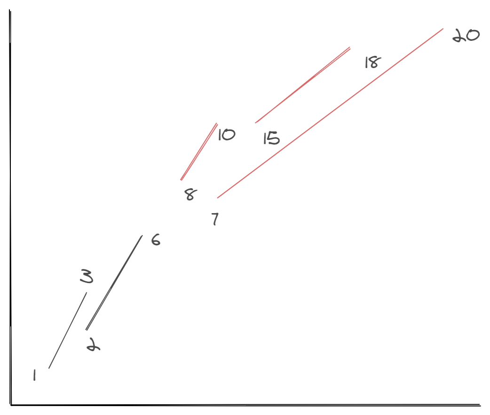
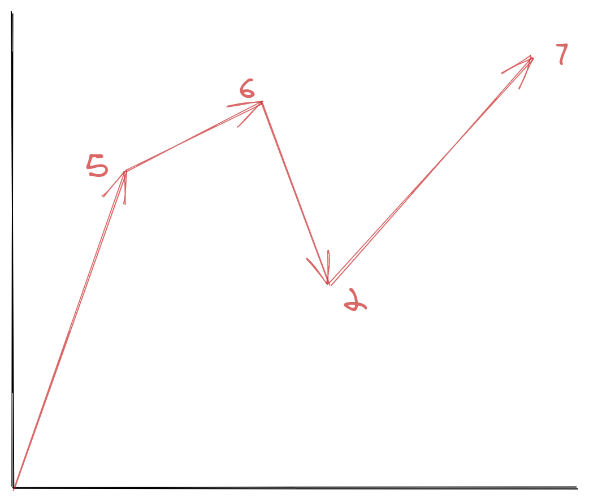

# 数组


## 56. 合并区间
>以数组 intervals 表示若干个区间的集合，其中单个区间为 intervals[i] = [starti, endi] 。请你合并所有重叠的区间，并返回一个不重叠的区间数组，该数组需恰好覆盖输入中的所有区间。输入：intervals = [[1,3],[2,6],[8,10],[15,18]]
输出：[[1,6],[8,10],[15,18]]
解释：区间 [1,3] 和 [2,6] 重叠, 将它们合并为 [1,6].


### 分析
合并多个区间，最关键的是判断前后两个区间是否有交集，如果有交集就找出两个区间的最小值和最大值，就是他们合并后的区间，如果没有交集，他们两个就是不重叠的区间。因此，**关键是如何找出两个数组中的元素有没有交集。**

如上图所示，我们可以发现
1. 如果两个区间之间有重合，那么前一个区间的第二个数应该大于第二个区间的第一个数。比如[1,3]和[2,6]两个区间，第一个区间的第二个值是3，第二个区间的第一个值是2，3>2因此，[1,3]和[2,6]是有重合的，他们可以进行区间合并。
2. 如果两个区间不重合，那么第一个区间的第二个值小于第二个区间的第一个值，比如[8,10]和[15,18]他们之间就是不重合的。

但是由于数组本身是无序的，它可能会出现[1,6],[8,10],[15,18]，这种突然又出现小的比较小的值，比如[2,9]，这样的话就会出现[2,9]需要和前面所有的进行比较，肯定是比较麻烦的。因此我们最好在一开始就按照区间的左侧的值进行排序，变成：[1,6],[2,9],[8,10],[15,18]这种有序的。然后再判断是否有重合。因此，我们最终的实现思路是：
1. 排序。按照区间的第一个数字进行排序。
2. 根据前后两个区间的第二个值和第一个值进行比较。判断重合。如果重合取最值，如果不重合就保存起来。
最终的代码实现如下：
```js
    var merge = function (intervals) {
        intervals.sort((a, b) => a[0] - b[0]); // [[2, 6], [1,9],[11, 13], [15, 18]]
        let results = [intervals[0]];
        for (let i = 1; i < intervals.length; i++) {
            let item = results[results.length - 1];
            if (intervals[i][0] > item[1]) {
                results.push(intervals[i]); // 这两个是不连续的
            } else {
                let min = Math.min(...item, ...intervals[i]);
                let max = Math.max(...item, ...intervals[i]);
                results[results.length - 1] = [min, max];
            }
        }
        return results;
    };
```

 
 ## 349.数组的并集
 >给定两个数组，编写一个函数来实现他们的并集。
 输入：nums1 = [1,2,2,1], nums2 = [2,2]
输出：[2]
输出结果中的每个元素一定是唯一的。
我们可以不考虑输出结果的顺序。
### 分析
所谓并集也就是记在A数组中有，又在B数组中有。因此，我们可以考虑使用一个hash来保存其中一个数组，然后再去遍历另外一个数组，判断对象中是否有数组元素。但是这样的话可能需要去重，因为交集元素必须是唯一的，因此，需要提前判断是否已经存在了这个元素。因此，最终的实现是：
1. 遍历第一个数组，将数组转化成map/obj。
2. 遍历第二个数组，判断数组中元素是否在obj中存在，同时判断并集中是否已经有了这个元素。
 ```js
var intersection = function(nums1, nums2) {
  let obj = {};
  for(let i = 0;i < nums1.length;i++){
      if(!obj[nums1[i]]){
          obj[nums1[i]] = true;
      }
  }
  let result = [];

  for(let j = 0;j < nums2.length;j++){
    let item = nums2[j];
    if (obj[item] && result.indexOf(item) === -1) {
        result.push(item);
    }
  }
  return result;
};
 ```
### 进一步优化：
我们知道在进行第二步遍历时，为了避免重复我们使用了`indexOf`进行查找，实际上我们只是希望已经
添加过的元素就不要再进行添加了，因此我们可以直接将`obj[item]`设置为false。这样的话下一次碰到这个就不会再进行添加了。
```js
var intersection = function (nums1, nums2) {
    let obj = {};
    for (let i = 0; i < nums1.length; i++) {
        if (!obj[nums1[i]]) {
            obj[nums1[i]] = true;
        }
    }
    let result = [];
    for (let j = 0; j < nums2.length; j++) {
        let item = nums2[j];
        if (obj[item]) {
            result.push(item);
            obj[item] = false;// 已经添加过了就不再允许添加了。
        }
    }
    return result;
};
```

### 使用set
将数组转化成set可以实现对数组去重，这样的话就避免后续去重的处理了。
然后判断哪个set的长度短，就遍历那个短的那个，判断长的中是否有这个元素。判断方法是使用filter进行筛选。
```js
var intersection = function (nums1, nums2) {
    let s1 = new Set(nums1);
    let s2 = new Set(nums2);
    let result = [];
    if(s1.size < s2.size){
      return [...s1].filter((item) => s2.has(item));
    }else{
      return [...s2].filter((item) => s1.has(item));
    }
};
```

### 如果两个数组的交集的元素可以重复，必须是出现次数最少的那个。
一开始我们就可以在遍历其中一个数组时，记录每个元素出现的次数，添加时每次减少一个，
如果最后等于0了，说明后来的元素出现次数比他多，那就不添加了。
```js
var intersect = function(nums1, nums2) {
  let obj = {};
  for(let i = 0;i < nums1.length;i++){
      let item = nums1[i];
      if(!obj[item]){
          obj[item] = 1;
      }else{
          obj[item] += 1;   // 看这里，看这里
      }
  }
  let result = [];
  for(let j = 0;j < nums2.length;j++){
    let item = nums2[j];
    if (obj[item] >0 ) {
        result.push(item);
        obj[item] -=1;     // 关键是看这里看这里
    }
  }
  return result;
};
```

## 求数组的并集
```js
const union = function (nums1,nums2){
    return [...new Set([...nums1,...nums2])];
}
```

## 665.非递减数列
我们的非递减数列需要满足： nums[i] <= nums[i + 1]， 如果出现了nums[i] <= nums[i + 1]， 我们需要修改他们的大小顺序。 我们最常规的想法就是将nums[i] 修改成 <= nums[i + 1]， 为了确保它比前面的都大， 最好修改成nums[i + 1]。 示例： ``
`js
[4,2,3]
第一个4>2。那么我们最常见的做法可能就是把4变成2。这样就变成[2,2,3]，实现了非递减数列。

但是我们有没有想过下面这种情况:

我们可以看下，6> 2，如果我们把6的值降下来确保小于等于2，这样的话会导致变成[0,5,2,2,7]，从而又出现了了不满足递减数列的情况。也就是说我们考虑时，不仅需要考虑满足后面的递减序列，还需要考虑满足前面的递减序列，因此不能只是修改nums[i](减小)，也可能是修改nums[i+1](增大)，具体修改哪一个需要根据与nums[i-1]的值进行判断。

* 如果nums[i+1] < nums[i-1]，那么只能修改nums[i+1]，让nums[i+1]增大。
* 如果nums[i+1] > nums[i-1]，那么只能修改nums[i],让nums[i]减小。
代码实现：
```js
var checkPossibility = function (nums) {
    let count = 0;
    for (let i = 0; i < nums.length - 1; i++) {
        if (nums[i] > nums[i + 1]) {
            if (i - 1 >= 0 && nums[i - 1] > nums[i + 1]) {
                nums[i + 1] = nums[i];
            } else if (i - 1 >= 0 && nums[i - 1] < nums[i + 1]) {
                nums[i] = nums[i + 1];
            }
            count += 1;
            if (count > 1) {
                return false;
            }
        }
    }
    return true;
};

```
## 202.快乐数
寻找快乐数的唯一麻烦的地方就是需要判断它是否会一直遍历计算下去，知道最后超出2^31的大小限制。
但是如果我们拿2^31作为边界条件肯定是不行的，肯定会超值，而且最终要的是可能存在死循环。事实上，
我们更加需要关注的是是否处于死循环，因此我们需要把计算过的每个值都保存下来，如果出现重复了，说明
有死循环出现，就不可能是快乐数了。
```js
/**
 * @param {number} n
 * @return {boolean}
 */
var isHappy = function (n) {
    let obj = {};
    while (true) {
        let arr = n.toString().split("");
        let sum = 0;
        for (let i = 0; i < arr.length; i++) {
            let item = Number(arr[i]);
            sum += Math.pow(item, 2);
        }
        if (sum === 1) {
            return true;
        } else {
            if (obj[sum]) {
                return false;
            } else {
                obj[sum] = true;
                n = sum;
            }
        }
    }
};
```
## 16. 判断一个数是否为质数
判断一个数是否为质数：
质数：只能被1和它本身整除，因此我们可以遍历从[2,n-1]，判断是否会被这中间的某一个值
整除，如果有就不是质数。
```js
var countPrimes = function(n) {
  let count = 0;
  for(let i = 2;i < n;i++){
      if(isPrimse(i)){
        count++;
      }
  }
  function isPrimse(n){
      for(let i = 2;i < n;i++){
          if(n % i === 0){return false}
      }
      return true;
  }
  return count;
};
```
但是这样的话，实际上就会导致超时，因为每一个数都遍历了[2,n-1]次,这种方法过于暴力了。
事实上，我们可以有更加优化的方法，因为，质数有一些特点：
1. 一个数如果是质数，那么他的倍数得到的数一定不是质数比如：

```js
2是一个质数，那么2*2,2*3,2*4,2*5...  2*n-1一定不是质数
3是一个质数，那么3*2,3*3,3*4,3*5... 3*n-1一定不是质数
```
2. 质数的查找范围是n的开平方+1，而不需要查找到n。
```js
var countPrimes = function(n) {
  let arr = new Array(n).fill(true);
  let count = 0;
  for(let i = 2;i < n;i++){
      if(arr[i]){
          count += 1;
          // 为什么从i*i开始，因为在之前i*(i-1)，已经被(i-1)*i遍历过了。
          for(let j = i*i; j<n;j +=i){
              arr[j] = false;
          }
      }
  }
  return count;
};
```
几个注意的地方：
1. 质数的最优遍历范围是[2,2^1/2+1]，但是这里很难理解。
2. j是从i*i开始的，因为在之前i*(i-1)，已经被(i-1)*i遍历过了。


## 7.反转整数
### 分析
反转整数不要用最笨的方法转化成数组，然后再进行反转。最常用的还是对10取余，每次都能够拿到最后一位，然后除以10，相当于减少了一位继续取余。最终我们如果要把它合并成多位数，那么需要乘以10加上余数。
这个才是正确的思路。
```js
var reverse = function (x) {
    let res = 0;
    while (x) {
        let n = x % 10;
        res = res * 10 + n;
        if (res > Math.pow(2, 31) - 1 || res < Math.pow(-2, 31)) return 0;
        x = parseInt(x / 10);  // 这里只能使用parseInt。因为可能是负数，如果使用Math.floor会出问题。
    }
    return res;
};
```

## 求数组的差集
 ## 数组问题的一些技巧
 1. 排序
