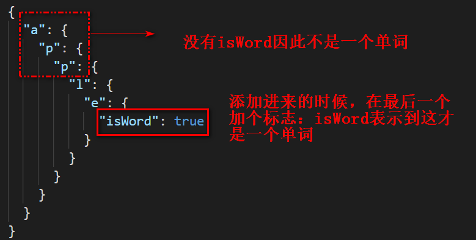

# 树

## 208 前缀树

前缀树实际上是用于查找或者说是索引，比如添加进去一个`apple`，那么它能够查找`a`,`ap`,`app`,`appl`和`apple`，但是它必须确保`apple`才是一个单词，而其他的都是它的前缀。因此，重要的是要区分前缀和单词。思路如下图所示：

在添加时我们就在最末尾添加一个字段`isWord`，用来标记是否是一个完整的单词。如果没有这个字段表明只是一个前缀。
**插入元素**

```js
Trie.prototype.insert = function(word) {
  let node = this.root;
  for (let i = 0; i < word.length; i++) {
    let item = word[i];
    if (!node[item]) {
      node[item] = {};
    }
    node = node[item];
  }
  node.isWord = true;
};
```
