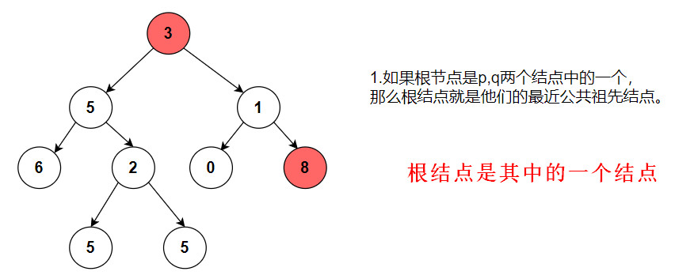
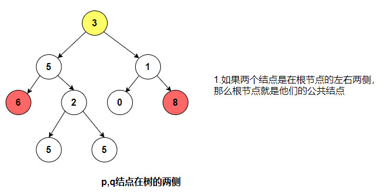
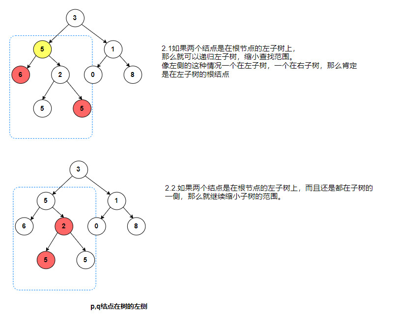
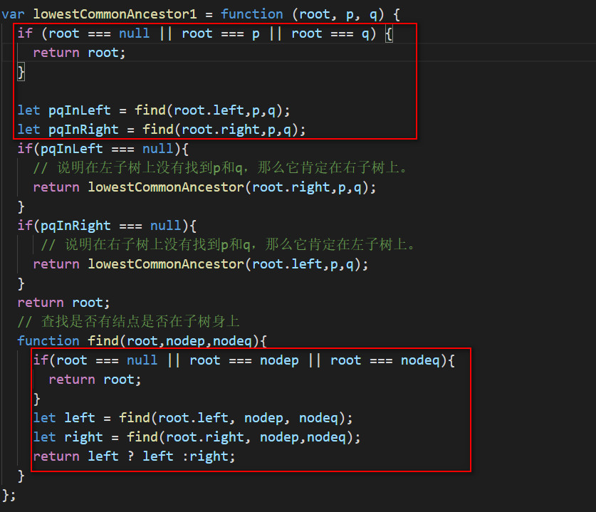

# 二叉树

## 236. 二叉树的最近公共祖先

### 分析

要找到二叉树的最近公共祖先，首先我们要知道都有哪几种情况：

1. 根结点就是其中的一个结点。
   
   如果根结点就是其中的一个结点，那么根结点一定是最近公共祖先结点。

2. 两个结点在根节点的左右两侧。
   
   如上图所示，我们可以看到如果两个结点分别分布在根节点的左右两侧，也就是说左子树和右子树上，那么他们的公共祖先结点一定只能是根结点。

3. 如果两个结点在根节点的左子树上。
   <br>

如上图所示，如果两个结点都在根结点的左子树上，那么我们就可以缩小查找范围，只需要查找左子树即可，从左子树上开始查找。在左子树上查找可能又有两种情况：

- 一个在左侧一个在右侧，那么根结点就是他们的子节点。
- 都在同一侧，那么就继续缩小范围。
  最终要么返回他们的根结点，要么返回他们中的某一个结点。

4. 如果两个结点在根节点的右子树上。
   同理，如果两个结点都在右子树上，跟都在左子树上一样，也是缩小查找范围。

因此，我们最主要的问题就是，如何找到结点是否在某颗树上。实现代码如下：

```js
// 查找结点是否在子树身上
function find(root, node) {
  if (root === null || root === node) {
    return root;
  }
  let left = find(root.left, node);
  let right = find(root.right, node);
  return left ? left : right;
}
```

接下来我们就可以按照我们的思路来实现了。

### 暴力破解法

```js
var lowestCommonAncestor = function(root, p, q) {
  // 如果根结点是其中的某一个结点，那么就直接返回。
  if (root === null || root === p || root === q) {
    return root;
  }
  let pInLeft = find(root.left, p) !== null;
  let pInRight = !pInLeft;
  let qInLeft = find(root.left, q) !== null;
  let qInRight = !qInLeft;
  // 都在左子树上，就继续递归遍历左子树
  if (pInLeft && qInLeft) {
    return lowestCommonAncestor(root.left, p, q);
  }
  // 都在右子树上，就继续递归遍历右子树
  if (pInRight && qInRight) {
    return lowestCommonAncestor(root.right, p, q);
  }
  //一个在左子树一个在右子树那么就肯定是根结点
  return root;
  // 查找结点是否在子树身上
  function find(root, node) {
    if (root === null || root === node) {
      return root;
    }
    let left = find(root.left, node);
    let right = find(root.right, node);
    return left ? left : right;
  }
};
```

如上代码所示：我们每次都查找 p 或者 q 是在哪个子树上。这样的话每个树都得找两遍。事实上，我们只需要知道 pq 是否同时在左子树或者同时在右子树上。再进一步我们可以这样想：如果它全在左子树上，那么肯定不在右子树上，因此在右子树查找一定返回 null。同理，如果它全在右子树上，那么在左子树上查找一定返回 null，这样的话就可以根据返回结果来确定应该去哪颗树上查找。代码如下图所示：

```js
var lowestCommonAncestor1 = function(root, p, q) {
  if (root === null || root === p || root === q) {
    return root;
  }

  let pqInLeft = find(root.left, p, q);
  let pqInRight = find(root.right, p, q);
  if (pqInLeft === null) {
    // 说明在左子树上没有找到p和q，那么它肯定在右子树上。
    return lowestCommonAncestor(root.right, p, q);
  }
  if (pqInRight === null) {
    // 说明在右子树上没有找到p和q，那么它肯定在左子树上。
    return lowestCommonAncestor(root.left, p, q);
  }
  return root;
  // 查找是否有结点是否在子树身上
  function find(root, nodep, nodeq) {
    if (root === null || root === nodep || root === nodeq) {
      return root;
    }
    let left = find(root.left, nodep, nodeq);
    let right = find(root.right, nodep, nodeq);
    return left ? left : right;
  }
};
```

通过上面的分析，我们虽然简化了代码，但是提交后还是发现执行用时比较长，这是因为还是做了很多无用的查找。
事实上我们再进一步研究发现`lowestCommonAncestor1`也是返回一个结点，它和我们查找的过程是相似的。如下所示：

我们可以看上部分代码，可以发现实际上`lowestCommonAncestor1`也是查找，如果不在左子树就去右子树上查找，而`find`的功能就是查找两个结点是否在左子树上，然后再根据查找的结果来判断`lowestCommonAncestor1`中的第一个参数应该是哪个子树，事实上这个功能 lowestCommonAncestor1 已经有了，因此我们可以直接递归调用它本身即可。如下所示：

```js
var lowestCommonAncestor = function(root, p, q) {
  if (root === null || root === p || root === q) {
    return root;
  }
  let pqInLeft = lowestCommonAncestor(root.left, p, q); // p,q至少有一个存在左子树上。
  let pqInRight = lowestCommonAncestor(root.right, p, q); // p,q至少有一个存在右子树上。
  if (pqInLeft === null) {
    // 说明在左子树上没有找到p和q，那么它肯定在右子树上。
    return pqInRight;
  }
  if (pqInRight === null) {
    // 说明在右子树上没有找到p和q，那么它肯定在左子树上。
    return pqInLeft;
  }
  return root;
};
```

总而言之，二叉树的最近公共祖先就是不断地判断结点在哪颗树上，然后在这个树上找，如果找到一个就直接返回就行，说明它是最近的公共祖先结点，如果找到两个说明他们的祖先结点才是最近公共结点。

## 二叉树的遍历

### 先序遍历

```js
let preOrderTraversal = function(root) {
  const res = [];
  function traversal(root) {
    if (root !== null) {
      res.push(root.val); // 访问根节点的值
      traversal(root.left); // 遍历递归左子树
      traversal(root.right); // 遍历递归右子树
    }
  }
  traversal(root);
  return res;
};
```

### 中序遍历

```js
var inorderTraversal = function(root) {
  let res = [];
  function traversal(root) {
    if (root !== null) {
      traversal(root.left);
      res.push(root.val);
      traversal(root.right);
    }
  }
  traversal(root);
  return res;
};
```

### 后续遍历

```js
var postorderTraversal = function(root) {
  let res = [];

  function traversal(root) {
    if (root !== null) {
      traversal(root.left);
      traversal(root.right);
      res.push(root.val);
    }
  }
  traversal(root);
  return res;
};
```

### 层序遍历

#### 使用递归实现层序遍历

```js
var levelOrder = function(root) {
  let res = [];
  function traverse(root, depth) {
    if (root !== null) {
      if (!res[depth]) {
        res[depth] = [];
      }
      res[depth].push(root.val);
      traverse(root.left, depth + 1);
      traverse(root.right, depth + 1);
    }
  }
  traverse(root, 0);
  return res;
};
```

二叉树的层序遍历需要打印每一层的值，因此我们只需要给每一层都分配一个数组，数组的下标就是他们的层数即可。这样的话遍历的过程中，同一层的值都在同一个数组中。从而间接实现层序遍历。

#### 使用队列实现层序遍历

```js
var levelOrder = function(root) {
  if (root === null) {
    return [];
  }
  let results = [];
  let queue = [root];
  while (queue.length > 0) {
    let len = queue.length;
    let result = [];
    while (len--) {
      let node = queue.shift();
      if (node.left) {
        queue.push(node.left);
      }
      if (node.right) {
        queue.push(node.right);
      }
      result.push(node.val);
    }
    results.push(result);
  }
  return results;
};
```

## 100.相同的树

两个相同的树，实际上就是比较每个结点的值是否相同，也就是说我们需要遍历两颗树的结点。
正如我们之前分析的那样，这种递归都是先假设只有一个结点，也就是根节点，将根结点的所有操作
都放到递归函数中，然后去递归他的左右子树即可。

1. 定义一个递归函数

```js
function traversal(root1, root2) {
  if (root1 === null && root2 !== null) {
    return false;
  } else if (root1 !== null && root2 === null) {
    return false;
  } else if (root1 === null && root2 === null) {
    return true;
  }
}
```

2. 递归函数中对左右子树进行操作。

```js
var isSameTree = function(p, q) {
  function traversal(root1, root2) {
    if (root1 === null && root2 !== null) {
      return false;
    } else if (root1 !== null && root2 === null) {
      return false;
    } else if (root1 === null && root2 === null) {
      return true;
    } else {
      return (
        root1.val === root2.val &&
        traversal(root1.left, root2.left) &&
        traversal(root1.right, root2.right)
      ); // 对左右子树进行递归操作。
    }
  }
  return traversal(p, q);
};
```

## 226.翻转二叉树

翻转二叉树实际上就是遍历二叉树的每个结点，然后把他的左右子树进行交换。

1. 定义一个递归函数。函数功能是实现两个左右结点进行交换。
2. 递归调用函数。

```js
var invertTree = function(root) {
  if (root === null) {
    return root;
  }
  function traverse(root) {
    if (root === null) {
      return root;
    }
    let temp = traverse(root.right);
    root.right = traverse(root.left);
    root.left = temp;
    return root;
  }
  traverse(root);
  return root;
};
```

## 230. 二叉搜索树中第 k 小的元素

二叉搜索树的中序遍历就是一个有序数组。因此直接使用中序遍历就可以得到有序数组中第 k 小的值。

```js
var kthSmallest = function(root, k) {
  // 二叉搜索树中序遍历是有序数组
  let result = [];
  function traverse(root) {
    if (root !== null) {
      traverse(root.left);
      result.push(root.val);
      traverse(root.right);
    }
  }
  traverse(root);
  return result[k - 1];
};
```

## 199.二叉树的右视图

二叉树的右视图实际上就是层序遍历的每一层的最后一个值。

```js
var rightSideView = function(root) {
  if (root === null) {
    return [];
  }
  let result = [];
  let queue = [root];
  while (queue.length > 0) {
    let len = queue.length;
    let arr = [];
    while (len > 0) {
      let node = queue.shift();
      arr.push(node.val);
      if (node.left !== null) {
        queue.push(node.left);
      }
      if (node.right !== null) {
        queue.push(node.right);
      }
      len--;
    }
    result.push(arr);
  }
  // 得到的是层序遍历得到的结果 [ [1], [2,3], [ 5,4]] //
  let rightViewArr = [];
  result.forEach((item) => {
    rightViewArr.push(item[item.length - 1]);
  });
  return rightViewArr;
};
```

## 总结

### 查找一颗二叉树上是否有某个结点

递归时，先只考虑最简单的情形，就是一个根节点再加上两个左右子结点。

```js
// 查找结点是否在子树身上
function find(root, node) {
  if (root === null || root === node) {
    return root;
  }
  let left = find(root.left, node);
  let right = find(root.right, node);
  return left ? left : right;
}
```

### 递归遍历一颗树是二叉树题目时的最常用的方法

递归遍历一颗树是解决二叉树题目时最常用的方法，通常套路是定义一个递归的方法，
然后分别遍历根节点，遍历左子树，遍历右子树。这里需要注意一下，我们一般需要去找到
递归的最小单位，也就是重复部分。通常选择一个结点，就是根节点进行操作。将所有的操作都是在
一个节点上进行重复。先假设只有一个根节点应该如何操作。将根结点的所有操作
都放到递归函数中，然后去递归他的左右子树即可。因此，核心就是：

1. 定义一个递归函数，递归函数是对根节点操作
2. 递归函数中对左右子树进行递归操作。

### 使用递归时经常可以通过传入一些参数来实现我们的需求：

我们可以在 traverse 进行遍历的时候传入一个参数，用这个参数来实现我们的需求，比如参数收集，深度收集等。
无论是先遍历左子树还是遍历右子树，只要确保不影响我们最终的结果即可。

#### 104. 二叉树的最大深度为例：

```js
var maxDepth = function(root) {
  let res = 0;
  function traversal(root, depth) {
    if (root !== null) {
      if (depth > res) {
        res = depth;
      }
      if (root.left) {
        traversal(root.left, depth + 1);
      }
      if (root.right) {
        traversal(root.right, depth + 1);
      }
    }
  }
  traversal(root, 1);
  return res;
};
```

上面的二叉树的最大深度始终是递归到某一个子树时的深度，因此我们只需要记录一个深度的最大值即可。
始终是进行递归遍历，只不过遍历过程中做了一些操作罢了。

#### 538. 把二叉树转化为搜索累加树

实际上就是实现一次后续遍历。每次记录累加的值。然后更新最大的值即可。

```js
var convertBST = function(root) {
  // 每个节点的值  等于右子树的值+它自身的值
  let sum = 0;
  function traverse(root) {
    if (root) {
      traverse(root.right);
      root.val = sum + root.val;
      sum = root.val;
      traverse(root.left);
    }
  }
  traverse(root);
  return root;
};
```

#### 559. N 叉树的最大深度

```js
var maxDepth = function(root) {
  if (root === null) {
    return 0;
  }
  let maxDepth = 1;
  function traverse(root, depth) {
    if (root) {
      if (maxDepth < depth) {
        maxDepth = depth;
      }
      for (let i = 0; i < root.children.length; i++) {
        traverse(root.children[i], depth + 1);
      }
    }
  }
  traverse(root, maxDepth);
  return maxDepth;
};
```

#### 二叉树的锯齿型层序遍历

```js
var zigzagLevelOrder = function(root) {
  if (root == null) {
    return [];
  }
  let result = [];
  function traverse(root, depth) {
    if (root) {
      if (!result[depth]) {
        result[depth] = [];
      }
      if (depth % 2 === 0) {
        result[depth].push(root.val);
      } else {
        result[depth].unshift(root.val);
      }
      if (root.left) {
        traverse(root.left, depth + 1);
      }
      if (root.right) {
        traverse(root.right, depth + 1);
      }
    }
  }
  traverse(root, 0);
  return result;
};
```
