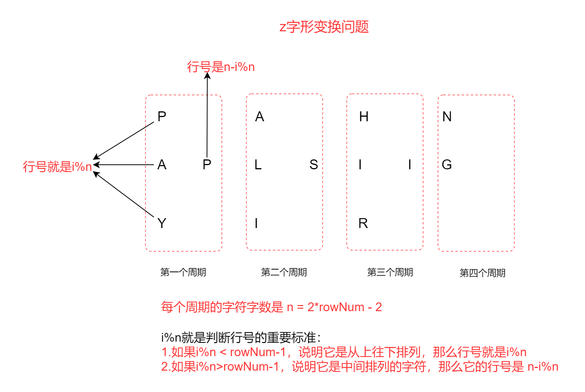

# 热门


## z字形变换

自行变化需要按照从上往下也就是行号来输出字符。因此最关键的就是根据索引找到每个元素对应的行号。
很明显z字形它是一个循环的过程，我们需要找到这个循环的周期，然后根据这个周期找到对应的行号。

```js
var convert = function (s, numRows) {
  // 确定周期  
  let n = 2*numRows - 2;   // 周期
  if(n === 0) return s;
  // 确定行号
  let rowCount = 0;
  let arr = new Array(numRows).fill("");
  for (let i = 0; i < s.length; i++) {
    rowCount = (i % n) < numRows -1 ? i %n:n-(i%n);
    console.log(1111);
    console.log("rowCount:",rowCount)
    arr[rowCount] += s[i];
  }
  console.log(arr)
  return arr.join("");
};
let s = "A", numRows = 1;
```