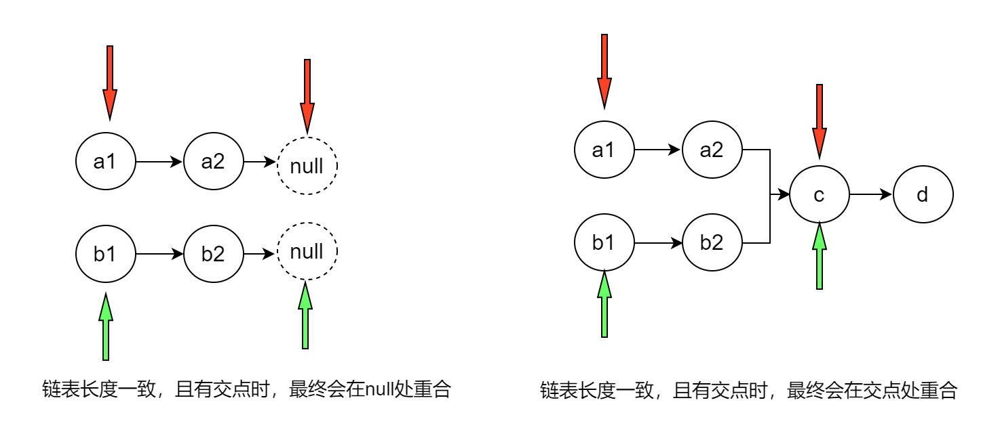
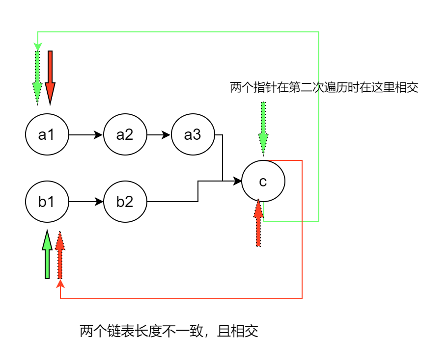

# 链表相关的算法

链表常见的算法主要有，翻转链表，判断链表是否有环，查找链表的第 k 个数等。

## 160.相交链表

### 方法一：添加标记法。

遍历第一个链表，然后给这个链表的每个字段一个标记，然后遍历第二个链表，查找是否有这个标记。

```js
var getIntersectionNode = function(headA, headB) {
  while (headA) {
    headA.flag = true;
    headA = headA.next;
  }
  while (headB) {
    if (headB.flag) {
      return headB;
    }
    headB = headB.next;
  }
  return null;
};
```

### 方法二：使用 map。

我们可以先遍历其中一个链表，然后将其链表的每个结点保存到 hash 中，由于每个结点都是一个引用地址，因此，不能使用对象 obj 这种数据结构，必须使用 map 这种数据接口。然后再遍历第二个链表，判断 map 中是否有值，如果有说明是相交的。

```js
var getIntersectionNode = function(headA, headB) {
  var hashMap = new Map();
  while (headA) {
    hashMap.set(headA, headA.val);
    headA = headA.next;
  }
  while (headB) {
    if (hashMap.has(headB)) {
      return headB;
    }
    headB = headB.next;
  }
  return null;
};
```

### 方法三：使用 双指针法。

使用双指针的一个最重要的判断条件就是什么时候结束循环。一般是两种：

1. 某一个指针到达了最后
2. 两个指针重合了。这种情况需要考虑什么时候两个指针会重合。
   对于这道题，我们知道无法直接通过一个指针到达终点就结束循环，因为两个链表的长度不一致。因此，这里的终止循环条件是：
   两个指针重合了。两个链表只有同时遍历他们的总的长度的时候，才会出现重合。因此，我们在遍历完一个指针之后，需要把它移动到另外一个链表的表头

**如果链表长度一致：**

1. 如果不存在重合，那么他们最终都会在终点处重合即 p1 === p2 === null。
2. 如果存在重合，那么他们最终会在重合位置相交即 p1 = p2 === node。
   如下图所示：
   
   **如果链表长度不一致：**

如果两个链表长度不一致，那么会导致一个链表遍历完了，另一个链表还没有遍历结束，这样的话，哪怕他们有交点，也直接错过了。我们必须让两个链表在同一时间到达同一位置，也就是说必须让两个链表遍历的长度是相同的。因此，我们可以考虑遍历两个链表的和的长度，比如一个链表的长度为 4，一个链表的长度为 3，那么我么可以考虑遍历长度为 7 的链表，这样的话如果有相交的话，他们一定会在他们的长度和的位置相交。实际上，也就是说我们每次遍历完一个之后就把指针移动另外一个链表的头部，再次进行遍历，直到两个指针相等为止，如果不存在交点，也会在 null 处相交。

1. 遍历两个链表的和的长度，如果有交点，则 p1 === p2 === node。
2. 如果没有交点，则 p1 === p2 === null。
   如下图所示：
   
   综上所示，我们可以发现，我们只需要判断两个链表是否相等即可结束循环。

```js
var getIntersectionNode = function(headA, headB) {
  if (!headA || !headB) return null;

  let pA = headA,
    pB = headB;
  while (pA !== pB) {
    pA = pA === null ? headB : pA.next;
    pB = pB === null ? headA : pB.next;
  }
  return pA;
};
```

## 876.链表的中间结点

像这种链表的第 k 个结点，都是使用快慢指针，快指针先走一段距离，或者快指针每步多走一段距离，这样的话，当快指针刚好到达终点的时候，慢指针正好指向我们要求的结点。
链表的中间结点：

1. 快指针每次比满指针多走以北的步数，当快指针到达链表尾部时，慢指针刚好到达中间点。

```js
var middleNode = function(head) {
  let slow = head,
    fast = head;
  while (fast && fast.next) {
    slow = slow.next;
    fast = fast.next.next;
  }
  return slow;
};
```

## 寻找链表的倒数第 k 个结点

同样是根据上面的分析，想要寻找倒数第 k 个结点，那么只需要让快指针先走 k 步，然后快慢指针按照相同的速度前进，
当快指针到达链表尾部的时候，那么满指针所指向的就是第 k 个结点。

```js
var getKthFromEnd = function(head, k) {
  let slow = head;
  let fast = head;
  let index = 1;
  while (index <= k) {
    fast = fast.next;
    index += 1;
  }
  while (fast) {
    fast = fast.next;
    slow = slow.next;
  }
  return slow;
};
```

## 合并两个有序链表

合并两个有序链表的思路和合并两个有序数组的思路是一样的，都是通过在两个链表的头部定义一个指针，
然后每次比较以下，小的放到新链表的后面，因此，最关键的是我们需要定义个新的变量来标记新链表的尾部，
而不能直接去操作新链表的头部，因为我们最终需要返回这个新链表的头。

```js
var mergeTwoLists = function(l1, l2) {
  let newNode = new ListNode(-1);
  let current = newNode;
  while (l1 && l2) {
    if (l1.val <= l2.val) {
      current.next = l1;
      l1 = l1.next;
    } else if (l2.val < l1.val) {
      current.next = l2;
      l2 = l2.next;
    }
    current = current.next;
  }
  if (l1) {
    current.next = l1;
  }
  if (l2) {
    current.next = l2;
  }
  return newNode.next;
};
```

## 从尾到头反过来打印链表

像这种需要从尾到头打印链表的值得，我们如果按照正常顺序，打印出来的数组就是正常顺序，然后将结果翻转就行。
当然我们可以直接在打印时，通过`unshift`进行打印。

```js
var reversePrint = function(head) {
  let current = head;
  let result = [];
  while (current) {
    result.unshift(current.val);
    current = current.next;
  }
  return result;
};
```

## 链表中的第 k 个结点

```js
var getKthFromEnd = function(head, k) {
  let slow = head;
  let fast = head;
  let index = 1;
  while (index <= k) {
    fast = fast.next;
    index += 1;
  }
  while (fast) {
    fast = fast.next;
    slow = slow.next;
  }
  return slow;
};
```

## 234 回文链表

```js
var isPalindrome = function(head) {
  if (head === null || head.next === null) {
    return true;
  }
  var prev = head;
  var current = head; // 用于找到最后的节点
  while (current.next) {
    prev = current;
    current = current.next;
  }
  if (current.val !== head.val) {
    return false;
  } else {
    prev.next = null;
    return isPalindrome(head.next);
  }
  return true;
};
```


## 148.排序链表
对链表进行排序，最暴力的方法就是比较每个结点和它的下一个结点的值，类似于冒泡排序，每次都能够得到最大的一个值。但是
我们需要首先知道链表的长度，只有知道长度我们才知道需要遍历多少遍。
### 暴力破解法
```js
var sortList = function (head) {
  if(head == null){return head};
  let current = head;
  let len = 0;
  // 获取链表长度
  while(current){
    len +=1;
    current = current.next;
  }
  for(let i = 0;i < len -1;i++){
    current = head;
    while(current.next) {
        if (current.next.val < current.val){
            // 交换值
            let temp = current.val;
            current.val = current.next.val;
            current.next.val = temp;
        }
        current = current.next;
    }
  }
  return head;
};

```


## 总结：

1. 像求链表中第 k 个，倒数第 k 个，中间结点的题目，都是使用快慢指针，让快指针到达终点时，慢指针刚好在所求的指针的位置上。

2. 像链表是否相交，链表是否有环啊，这种也都是通过快慢指针，但是需要确保他们走过相同的长度的链表。

3. 链表中绝大多数情况都可以通过 while 循环，但是还是有很多情况可以通过递归来实现的。如果我们需要从后往前拿到链表的数据，通常这种情况就需要通过递归来实现了。
